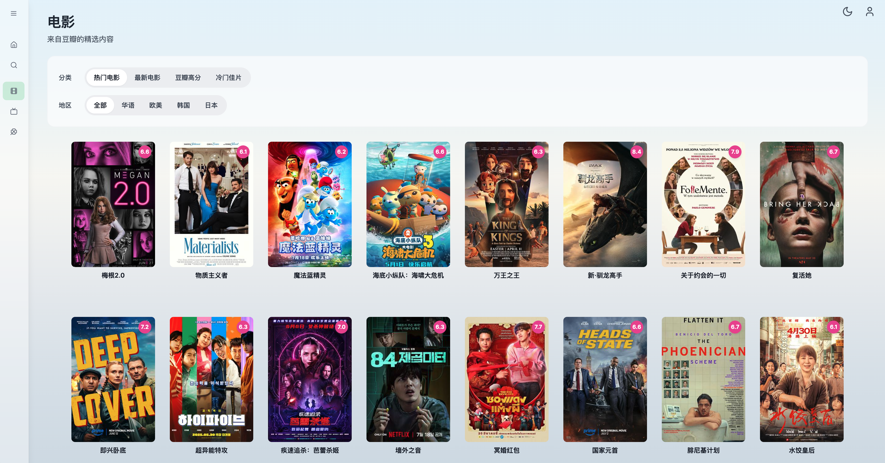
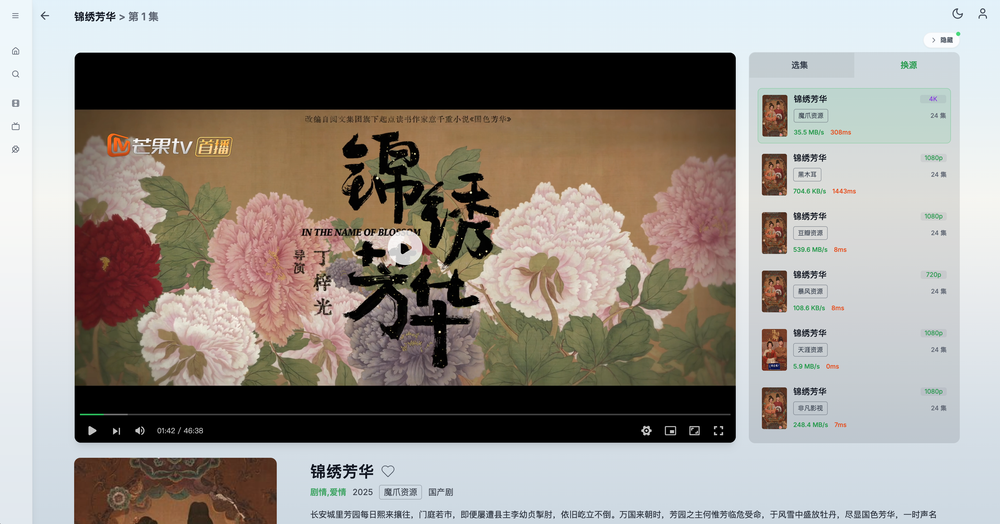

<div align="center">
  

  <h1>LunaTV</h1>
  <p><strong>為繁體中文使用者優化的自架影音聚合平台</strong></p>


</div>

可自架的影音**聚合播放殼**：本身**不提供、不託管、不儲存任何影片**。  
把你合法可用的 CMS／VOD API（與可選的 IPTV 源）接進來後，負責搜尋、選集、播放與進度同步。

本倉庫是 [MoonTechLab/LunaTV](https://github.com/MoonTechLab/LunaTV) 的二次開發，介面與搜尋針對**繁體中文**調整。建議部署在 **2 核 4GB 以上**。

> [!IMPORTANT]
> **部署後是空殼。** 沒有內建播放源或直播源。  
> 來源須由部署者自行設定，合法性與可用性由部署者負責。  
> 請設強密碼，僅供個人／小範圍使用，不要公開分享實例連結。

<details>
  <summary>專案截圖</summary>
  
  
  
</details>

## 目錄

- [功能](#功能)
- [部署](#部署)
  - [選哪一種](#選哪一種)
  - [Docker Compose + Kvrocks（推薦）](#docker-compose--kvrocks推薦)
  - [Docker Compose + Redis](#docker-compose--redis)
  - [Vercel + Upstash](#vercel--upstash)
  - [更新](#更新)
- [第一次使用](#第一次使用)
- [播放源與設定檔](#播放源與設定檔)
- [環境變數](#環境變數)
- [客戶端](#客戶端)
- [本機開發](#本機開發)
- [常見問題](#常見問題)
- [安全與合規](#安全與合規)
- [致謝](#致謝)
- [License](#license)

## 功能

- **多源搜尋**：一次查已啟用的 CMS／VOD；繁簡轉換、台譯／陸源片名橋接、長標題與 `～`／`×` 等副標拆分
- **追劇播放**：ArtPlayer + hls.js；跳過片頭片尾、斷點續播、自動連播、換源接續進度；直連失敗會改走站內 HLS 代理再試
- **集數追更**：進播放頁背景刷新詳情；最後一集再按下一集會向詳情 API 確認是否有新集
- **探索**：豆瓣電影／劇集／綜藝、Bangumi 每日放送
- **IPTV**：匯入 M3U、頻道分組、XMLTV 節目單（網頁直播可在後台開關）
- **同步**：觀看紀錄、收藏、搜尋歷史可跨裝置（Kvrocks／Redis／Upstash）
- **管理**：片源拖曳排序、三級檢測（可搜／可解／可播）、健康頁與熔斷重置（不自動關源）
- **客戶端**：可當 [Selene](https://github.com/MoonTechLab/Selene)／[Selene-TV](https://github.com/MoonTechLab/Selene-TV) 後端（MoonTV v100）

## 部署

映像：`ghcr.io/berserker8888/lunatv:latest`（也可改 `3.5.2` 等版本 tag）  
架構：amd64／arm64。

### 選哪一種

| 方式                         | 適合              | 儲存    | 備註                 |
| ---------------------------- | ----------------- | ------- | -------------------- |
| **Docker Compose + Kvrocks** | VPS／NAS 長期自架 | Kvrocks | **推薦**，資料落盤   |
| Docker Compose + Redis       | 已有 Redis        | Redis   | 請開 AOF／持久化     |
| Vercel + Upstash             | 不想管機器        | Upstash | 必須設 `CRON_SECRET` |

`STORAGE_TYPE` 與 `NEXT_PUBLIC_STORAGE_TYPE` 必須相同。

### Docker Compose + Kvrocks（推薦）

建立 `docker-compose.yml`：

```yaml
services:
  lunatv:
    image: ghcr.io/berserker8888/lunatv:latest
    container_name: lunatv
    restart: unless-stopped
    ports:
      - '3000:3000'
    environment:
      - USERNAME=admin
      - PASSWORD=請改成夠長的強密碼
      - STORAGE_TYPE=kvrocks
      - NEXT_PUBLIC_STORAGE_TYPE=kvrocks
      - KVROCKS_URL=redis://kvrocks:6666
      - NEXT_PUBLIC_SITE_NAME=LunaTV
      # 前面有 HTTPS 反代時建議加上：
      # - SITE_BASE=https://tv.example.com
      # - TRUST_PROXY=true
      # - SESSION_SECRET=另設一串隨機密鑰
    depends_on:
      - kvrocks
    networks:
      - lunatv

  kvrocks:
    image: apache/kvrocks:latest
    container_name: lunatv-kvrocks
    restart: unless-stopped
    volumes:
      - kvrocks-data:/var/lib/kvrocks
    networks:
      - lunatv

networks:
  lunatv:

volumes:
  kvrocks-data:
```

```bash
docker compose up -d
# 開啟 http://主機IP:3000 ，用 USERNAME / PASSWORD 登入
```

兩個服務必須在同一 Docker network；`KVROCKS_URL` 的主機名用 compose 服務名（上例是 `kvrocks`）。容器會探測 `/api/health`。

區網用 `http://192.168.x.x:3000` 即可登入。前面是 HTTPS 反代時，設 `SITE_BASE` 與 `TRUST_PROXY=true`。

### Docker Compose + Redis

```yaml
services:
  lunatv:
    image: ghcr.io/berserker8888/lunatv:latest
    container_name: lunatv
    restart: unless-stopped
    ports:
      - '3000:3000'
    environment:
      - USERNAME=admin
      - PASSWORD=請改成夠長的強密碼
      - STORAGE_TYPE=redis
      - NEXT_PUBLIC_STORAGE_TYPE=redis
      - REDIS_URL=redis://redis:6379
      - NEXT_PUBLIC_SITE_NAME=LunaTV
    depends_on:
      - redis

  redis:
    image: redis:7-alpine
    restart: unless-stopped
    command: redis-server --appendonly yes
    volumes:
      - redis-data:/data

volumes:
  redis-data:
```

### Vercel + Upstash

1. Fork 本倉庫，在 [Vercel](https://vercel.com) 匯入
2. 建立 [Upstash Redis](https://upstash.com/)，取得 REST URL 與 TOKEN
3. 設定環境變數後部署：

```env
USERNAME=admin
PASSWORD=你的強密碼
STORAGE_TYPE=upstash
NEXT_PUBLIC_STORAGE_TYPE=upstash
UPSTASH_URL=https://xxxx.upstash.io
UPSTASH_TOKEN=你的_token
CRON_SECRET=自訂一串夠長的隨機字串
NEXT_PUBLIC_SITE_NAME=LunaTV
```

`vercel.json` 會排程呼叫 `/api/cron`，**必須設定 `CRON_SECRET`**。

### 更新

```bash
docker compose pull
docker compose up -d
```

登入後可看版本面板或健康頁的 version。也可用 Watchtower 自動拉映像。

## 第一次使用

1. 用環境變數的 `USERNAME`／`PASSWORD` 登入
2. 打開 **管理面板 → 影片來源**，新增蘋果 CMS 風格 API（或貼設定檔／訂閱網址）
3. 跑 **三級檢測**：至少要「可搜」，理想是「可搜／可解／可播」
4. 回首頁或搜尋頁，搜一部你知道源站有的片子並播放
5. （可選）健康頁看儲存、cron、熔斷與最近檢測

登入後若進警告頁：`PASSWORD` 沒注入，或用了 `admin`／`123456` 這類弱密碼。

### 三級檢測

| 結果     | 含義                     | 建議         |
| -------- | ------------------------ | ------------ |
| 可播     | 能搜、能解集數、抽樣能播 | 優先使用     |
| 部分通過 | 多半能搜，詳情或試播失敗 | 可當備援     |
| 無結果   | API 通但這次關鍵詞沒命中 | 換詞再測     |
| 無效     | 連線或協定失敗           | 查 URL／網路 |

檢測失敗**不會**自動停用來源。後台可一鍵重置健康／熔斷，不改來源啟停。

## 播放源與設定檔

本專案**不附來源**。請只接入你有權使用的 API。支援蘋果 CMS V10（`/api.php/provide/vod`）。

加入方式：

1. 管理面板 → 影片來源（逐筆）
2. 管理面板 → 設定檔（整份貼上）
3. 訂閱遠端 JSON
4. 掛載 `config.json`，或設 `CONFIG_FILE_PATH`

```json
{
  "cache_time": 7200,
  "api_site": {
    "example": {
      "api": "https://example.com/api.php/provide/vod",
      "name": "示例資源",
      "detail": "https://example.com"
    }
  }
}
```

- `api`：vod JSON API
- `name`：後台與搜尋顯示名稱
- `detail`：可選，部分站要用網頁根網址補詳情

直播源在 **直播來源** 管理（M3U URL，可選 UA／EPG）。網頁直播與 App 直連分開：後台關掉網頁直播，不影響 Selene 拉源列表。

可選：站點設定 → **搜尋時優先使用檢測較佳的源**（只改排序，不自動停用）。

## 環境變數

| 變數                       | 何時需要     | 說明                                                     |
| -------------------------- | ------------ | -------------------------------------------------------- |
| `USERNAME`                 | 必填         | 站長帳號                                                 |
| `PASSWORD`                 | 必填         | 站長密碼，請用夠長且不好猜的值                           |
| `STORAGE_TYPE`             | 強烈建議     | `kvrocks`／`redis`／`upstash`／`localstorage`            |
| `NEXT_PUBLIC_STORAGE_TYPE` | 強烈建議     | 必須與 `STORAGE_TYPE` 相同                               |
| `KVROCKS_URL`              | kvrocks      | 例如 `redis://kvrocks:6666`                              |
| `REDIS_URL`                | redis        | 例如 `redis://redis:6379`                                |
| `UPSTASH_URL`              | upstash      | Upstash HTTPS endpoint                                   |
| `UPSTASH_TOKEN`            | upstash      | Upstash token                                            |
| `SESSION_SECRET`           | 多使用者建議 | 登入簽章密鑰；未設則回退 `PASSWORD`                      |
| `CRON_SECRET`              | Vercel 必填  | 保護 `/api/cron`                                         |
| `NEXT_PUBLIC_SITE_NAME`    | 否           | 站名，預設 LunaTV                                        |
| `ANNOUNCEMENT`             | 否           | 公告                                                     |
| `SITE_BASE`                | HTTPS 反代   | 公開網址，例如 `https://tv.example.com`                  |
| `COOKIE_SECURE`            | 否           | `true`／`false` 強制 cookie Secure；未設則依實際協定判斷 |
| `TRUST_PROXY`              | HTTPS 反代   | 設 `true` 才採信 `X-Forwarded-*`。直連埠對映不要開       |
| `BANGUMI_ACCESS_TOKEN`     | 否           | 提高 Bangumi 別名查詢額度                                |

豆瓣資料／圖片代理可在後台或本機設定調整，預設走公開 CDN。

## 客戶端

對齊 MoonTV v100，可用官方 App 當客戶端，進度與收藏和網頁同一組帳號。

| 客戶端                                                | 平台       |
| ----------------------------------------------------- | ---------- |
| [Selene](https://github.com/MoonTechLab/Selene)       | 手機／桌面 |
| [Selene-TV](https://github.com/MoonTechLab/Selene-TV) | Android TV |

1. 儲存請用 Kvrocks／Redis／Upstash（`localStorage` 無法跨裝置）
2. App 伺服器地址填 `https://你的網域`（含協定，不要 `/api`，不要結尾斜線）
3. 帳號用站長或後台建立的使用者
4. 連線探測走 `/api/health`

豆瓣首頁、Bangumi 日曆由 App 自己請求，不經本站。

## 本機開發

Node.js ≥ 20.9（建議 24）、pnpm ≥ 10。

```bash
pnpm install
pnpm dev          # http://localhost:3000
pnpm build
pnpm lint
pnpm typecheck
pnpm test
```

```env
USERNAME=admin
PASSWORD=請改成開發用密碼
STORAGE_TYPE=localstorage
NEXT_PUBLIC_STORAGE_TYPE=localstorage
```

正式站不要用 `localstorage`。

## 常見問題

**部署後什麼都沒有？**  
正常。到管理面板自己加源。

**搜得到但播不了？**  
跑三級檢測。若「搜✓ 解✓ 播✗」，多半是該源 m3u8／CDN，換源或稍後再試。直連 CORS 失敗時會自動改走站內代理再播一次。

**選集只有 1 集？**  
請拉最新映像並 Ctrl+F5。若該源詳情本身只有一條網址，換源即可。

**設了密碼還是警告頁？**  
弱密碼（如 `admin`、`123456`）與空白密碼會被擋下。改成強密碼後重啟。

**可以用 Selene 連嗎？**  
可以，見 [客戶端](#客戶端)。

**和上游映像能混用嗎？**  
不建議混 tag。升級前請先在後台匯出備份。

## 安全與合規

- 只提供搜尋與播放介面，不內建片庫
- 請遵守當地法律與來源條款；勿把實例當公開片站
- 寫入 API 驗登入簽章；管理功能依角色授權
- 代理層阻擋內網位址（SSRF）；點播預設瀏覽器直連 CDN
- 不建議在中國大陸主流社群宣傳此類自架專案

因設定來源、公開分享或部署所生風險，由使用者自行承擔。

## 致謝

- 上游：[MoonTechLab/LunaTV](https://github.com/MoonTechLab/LunaTV)
- [LibreTV](https://github.com/LibreSpark/LibreTV)
- [ArtPlayer](https://github.com/zhw2590582/ArtPlayer)、[HLS.js](https://github.com/video-dev/hls.js)
- 豆瓣代理／CDN 方案貢獻者（Zwei、CMLiussss 等）

## License

[CC BY-NC-SA 4.0](LICENSE)

- 姓名標示
- **非商業性**
- 相同方式分享

衍生作品須保留本專案與上游致謝，並以相同授權釋出。禁止商業用途。
